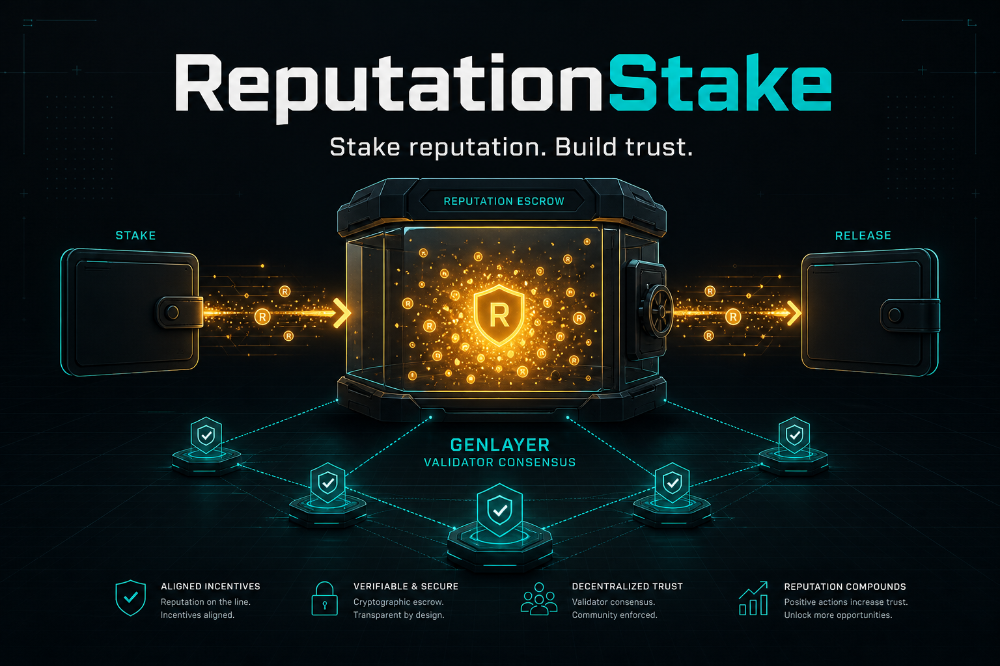

# ReputationStake

<p align="center">
  
</p>

<p align="center">
  <strong>Escrow reputation against a promise. Only consensus can slash it.</strong>
</p>

<p align="center">
  <a href="https://valentinzubok.github.io/ReputationStake/"></a>
  <a href="https://github.com/valentinzubok/ReputationStake/actions/workflows/ci.yml"></a>
  
  <a href="LICENSE"></a>
</p>

---

## The trust problem

Someone promises something off-chain and you want them to have skin in the game. Escrow alone does
not help: somebody still has to decide whether the promise was kept, and whoever decides can lie.
Give the counterparty the key and they can take the stake; give the staker the key and they can walk
away; give an arbiter the key and you are back to trusting a person.

**ReputationStake puts the breach question itself under consensus.** A slash only moves the escrow
when GenLayer validators, each reading the *same frozen* evidence, independently agree the
obligation was breached.

```
stake(amount, target, purpose)         staker escrows units against a named obligation
release(stake_id)                      target (or owner): obligation met, units return
slash(stake_id, reason, evidence_url)  the arbiter asks the network, it does not decide alone:
      1. validators fetch evidence_url and agree on its SHA-256 + text (eq_principle.strict_eq)
      2. their LLMs read that FROZEN text against `purpose` and `reason`
         and agree on one boolean `breach` (prompt_comparative)
      3. breach == true  → escrow moves to the target, verdict + evidence hash stored
         breach == false → the whole transaction aborts, escrow untouched
```

The last line is the product: **an arbiter cannot slash on assertion alone.**

## Live

| | |
|---|---|
| Console | **https://valentinzubok.github.io/ReputationStake/** (reads work with no wallet) |
| Network | GenLayer Studio Dev / Studio Next — chain `61997` |
| Contract | [`0x795b7661E10dF78BEd921dB7986C05b115614015`](https://explorer-studio-dev.genlayer.com/address/0x795b7661E10dF78BEd921dB7986C05b115614015) |
| Source sha256 | `8945223c774a1837942948ceecb625f8ded16b478585d1eb8732d14c112bf858` — equals [`contracts/ReputationStake.py`](contracts/ReputationStake.py) |
| Deploy record | [`STUDIO_DEV_DEPLOY.md`](STUDIO_DEV_DEPLOY.md) — every lifecycle transaction |
| Contract-only repo | [ReputationStakeCore](https://github.com/valentinzubok/ReputationStakeCore) |

`scripts/verify_deployment.py` runs in CI and fails the build if the deployed bytes ever stop
matching the contract in this repository.

### What is on chain right now

`get_stats` → `{"total":3,"active":1,"released":1,"slashed":1,"total_escrowed":200}`

- `stake-1` — **active**, 200 escrowed. An arbiter tried to slash it with the hello page as
  evidence; the validators found no breach and the transaction
  [reverted](https://explorer-studio-dev.genlayer.com/tx/0xe0353c6a01b204dcfd4de92d0006417d49eea39b7966ef8153d04ac06c8fe46e).
- `stake-2` — **released** by the target.
- `stake-3` — **slashed**: evidence `https://example.com/` did not contain the promised text,
  validators agreed `breach: true`, the escrow moved and the evidence hash `8c1e8564…` is stored
  with the verdict.

## The console

[`web/`](web/) — Next.js 16 + `genlayer-js` 2.0.0-rc.1 + MetaMask, exported statically to GitHub
Pages. It handles the full transaction lifecycle: it estimates the Studio Dev fee, signs through the
wallet on chain 61997, waits for `ACCEPTED`, then re-reads the contract.

| Panel | Calls |
|---|---|
| Stake against a promise | `stake` (plus owner-only `credit_reputation`) |
| Release it | `release` |
| Ask for a slash | `slash` — arbiter only, with two example evidence URLs: one where the network refuses the slash, one where it agrees |
| Stakes on chain / events | `list_ids`, `get_stake`, `get_stats`, `get_balance`, `get_events` |

```bash
cd web
npm install
npm run dev      # http://localhost:3002
```

Reads need no wallet. For writes: connect MetaMask (the app adds/switches to chain 61997) and press
**Get test GEN** — Studio Dev charges a fee deposit on every transaction.

## EVM variant

[`evm/`](evm/) holds a Solidity `ReputationStake` + `MetaEvidence` pair (ERC-20 stakes,
`conditionMet` rewards, reason-tagged slashing) with Foundry tests — the same escrow shape for
chains without validator consensus.

## Contract tests

```bash
pip install -r requirements-dev.txt
coverage run -m pytest -q && coverage report -m     # 13 tests
```

The suite substitutes a fake GenVM module and covers the lifecycle, access control, validation and
both slash outcomes.

## API

See [`docs/API.md`](docs/API.md) and the method map in [`contracts/README.md`](contracts/README.md).

## License

MIT © 2026 Valentyn Zubok.
