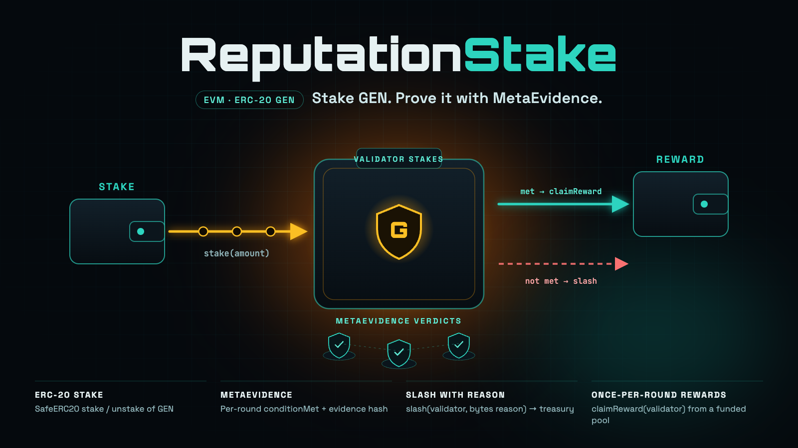
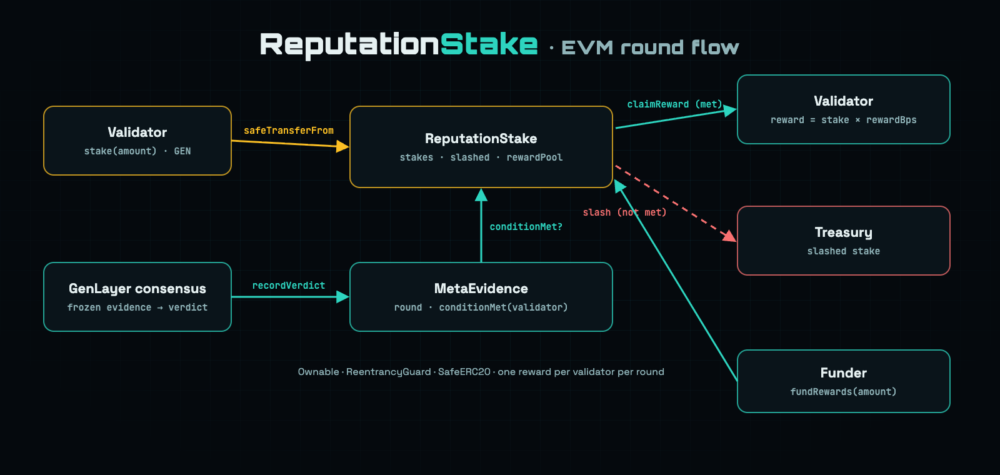

# ReputationStake · EVM

<p align="center">
  
</p>

<p align="center">
  <a href="https://github.com/valentinzubok/ReputationStake/actions/workflows/evm.yml"></a>
  
  
  
</p>

Solidity counterpart of the GenLayer [`ReputationStake`](../contracts/ReputationStake.py) intelligent contract.
Validators stake an ERC-20 token (e.g. GEN) as reputation. Each round, a **MetaEvidence** registry records whether
each validator met its condition, for example whether it voted with the final GenLayer consensus on frozen evidence:

- **condition met** → anyone can call `claimReward(validator)`, and the reward goes to the validator
- **condition not met** → the owner can `slash(validator, reason)`, and the whole stake goes to the treasury

<p align="center">
  
</p>

## Contracts

| File | Role |
|---|---|
| [`src/ReputationStake.sol`](src/ReputationStake.sol) | Stakes, slashing, rewards (`Ownable`, `ReentrancyGuard`, `SafeERC20`) |
| [`src/MetaEvidence.sol`](src/MetaEvidence.sol) | Round-based `conditionMet` verdicts with the evidence hash each one was judged on |
| [`src/interfaces/IMetaEvidence.sol`](src/interfaces/IMetaEvidence.sol) | `round()`, `hasVerdict(validator)`, `conditionMet(validator)` |

### ReputationStake API

| Function | Access | What it does |
|---|---|---|
| `stake(uint256 amount)` | validator | `safeTransferFrom` GEN into `stakes[msg.sender]`; blocked once slashed |
| `unstake(uint256 amount)` | validator | Withdraw part or all of an unslashed stake |
| `claimReward(address validator)` | anyone, `nonReentrant` | Needs a current-round verdict with `conditionMet == true`; pays `stake × rewardBps / 10 000` from `rewardPool`, once per round |
| `slash(address validator, bytes reason)` | `onlyOwner`, `nonReentrant` | Needs a current-round verdict with `conditionMet == false`; sends the whole stake to `treasury`, sets `slashed[validator]`, emits the reason and its hash |
| `fundRewards(uint256 amount)` | anyone | Top up the reward pool |
| `setMetaEvidence` · `setTreasury` · `setRewardBps` | `onlyOwner` | Wiring; `rewardBps` is capped at 50% |

**State:** `mapping(address => uint256) stakes` · `mapping(address => bool) slashed` ·
`mapping(address => mapping(uint256 => bool)) rewardClaimed` · `totalStaked` · `rewardPool`

**Events:** `Staked`, `Unstaked`, `Slashed(validator, amount, round, reasonHash, reason)`, `RewardClaimed(validator, round, reward)`,
`RewardsFunded`, `MetaEvidenceSet`, `TreasurySet`, `RewardBpsSet`

### Invariants the tests enforce

- A slash only happens with an explicit **not met** verdict. A missing verdict reverts with `NoVerdict`.
- A reward only pays out with a **met** verdict, at most once per validator per round, and never more than the pool holds.
- Slashing conserves tokens (fuzzed): contract balance always equals `rewardPool + totalStaked`.
- A slashed validator can neither stake again nor claim.

## Build and test

```bash
git clone --recursive https://github.com/valentinzubok/ReputationStake.git
cd ReputationStake/evm
forge build
forge test -vvv     # 13 tests incl. fuzz
```

## Deploy

```bash
OWNER=0x... TOKEN=0x<GEN ERC-20> TREASURY=0x... REWARD_BPS=1000 \
forge script script/Deploy.s.sol --rpc-url $RPC_URL --private-key $PRIVATE_KEY --broadcast
```

The script deploys `MetaEvidence` and `ReputationStake` wired together. The owner then records verdicts with
`MetaEvidence.recordVerdict(validator, met, evidenceHash)` and calls `advanceRound()` between rounds.

## Related

- [DealGuardCore](https://github.com/valentinzubok/DealGuardCore): EVM deal settlement on `conditionMet`
- [DealGuard](https://github.com/valentinzubok/DealGuard): GenLayer frozen-evidence escrow
